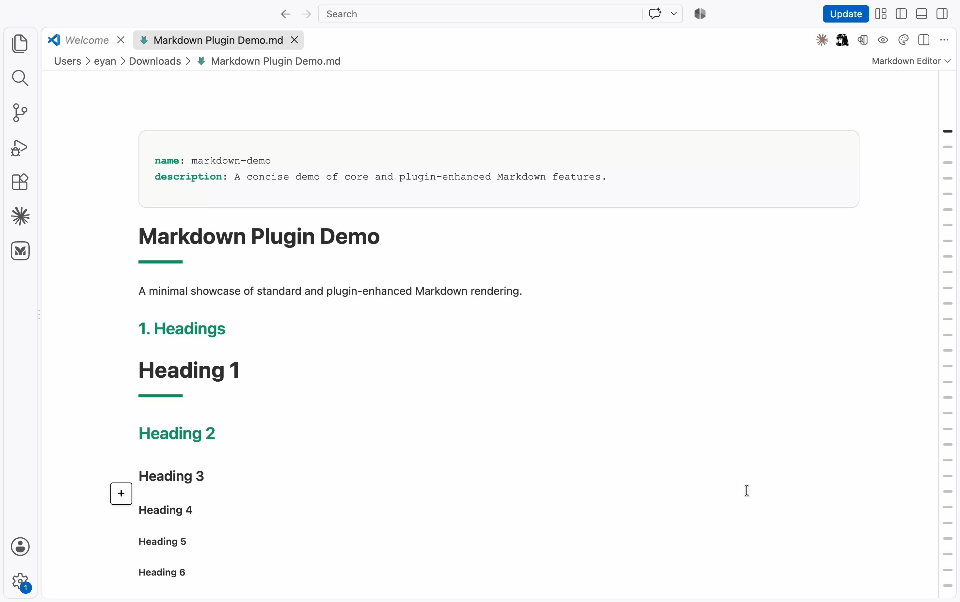

# markdown-editor-vs-code

# Markdown Editor

A preview-first Markdown editor for VS Code with rich rendering, three editing modes, outline navigation, themes, diagrams, equations, and practical code tools.

## Demo



## Editing Modes

Switch modes directly from the VS Code editor title bar.


| Mode           | Best for                                | Behavior                                                                                             |
| -------------- | --------------------------------------- | ---------------------------------------------------------------------------------------------------- |
| **Edit**       | Reading and making focused changes      | Edit Markdown directly in the rendered document. Click a block to expose its source when needed.     |
| **Split Edit** | Working with source and output together | Edit Markdown source on the left while the synchronized rendered preview stays visible on the right. |
| **Read Only**  | Reviewing and navigating                | Select and copy text or open links without entering edit mode.                                       |

All three modes operate on the same VS Code `TextDocument`, so changes remain connected to the active Markdown file.

## Rich Content Rendering

Markdown Editor supports standard and GitHub-Flavored Markdown content, including:

- Headings, paragraphs, emphasis, links, images, blockquotes, lists, and task lists
- Tables, fenced code blocks, syntax highlighting, and inline code
- KaTeX equations
- Mermaid and Flowchart diagrams
- Graphviz diagrams with responsive scaling
- ECharts visualizations
- Markmap and mind maps
- abc.js music notation
- PlantUML diagrams and SMILES structures through the bundled Vditor renderers

Some advanced renderers load their runtime dependencies from `unpkg.com` and require network access.

## Editing Tools

- Inline preview editing with block-level source access
- Synchronized source and rendered preview in Split Edit
- Code-block language labels, line numbers, and source copy actions
- Source copy actions for Mermaid, Flowchart, Graphviz, and ECharts blocks while editing
- Find in document with `Ctrl+F` or `Cmd+F`
- Local image paste and drag-and-drop through the upload handler
- Automatic image saving to a configurable asset folder
- Automatic synchronization with external changes to the VS Code document

## Outline Navigation

The document outline stays out of the way until it is needed:

- Hover over the right-side rail to expand it
- Pin it open while navigating a long document
- Jump directly to any heading
- Follow the active section as the document scrolls

Set `markdown-editor.defaultOpenOutline` to `true` to open the outline by default.

## Themes

Choose a rendering theme from the VS Code editor title bar:

- Default
- Pine Ink
- Red
- Orange
- Green

The Default theme follows the active VS Code light or dark appearance. The other themes provide consistent reading palettes independent of the workbench theme.

## Open Markdown Editor

Use any of these entry points:

1. Open a Markdown file, then run **Markdown Editor: Open with markdown editor** from the Command Palette.
2. Press `Ctrl+Shift+Alt+M` on Windows/Linux or `Cmd+Shift+Alt+M` on macOS.
3. Right-click a Markdown file in Explorer and select **Open with markdown editor**.
4. Right-click an open Markdown tab and select **Open with markdown editor**.
5. Use **Open With...** and select **Markdown Editor**. You can also configure it as the default editor for Markdown files.

## Settings


| Setting                               | Default   | Description                                                                                                                                              |
| ------------------------------------- | --------- | -------------------------------------------------------------------------------------------------------------------------------------------------------- |
| `markdown-editor.imageSaveFolder`     | `assets`  | Folder used for pasted, dropped, or uploaded local images. Supports`${projectRoot}`, `${file}`, `${fileBasenameNoExtension}`, and `${dir}` placeholders. |
| `markdown-editor.useVscodeThemeColor` | `true`    | Uses the active VS Code editor colors for the Default theme.                                                                                             |
| `markdown-editor.showLineNumbers`     | `false`   | Shows line numbers in the source editor.                                                                                                                 |
| `markdown-editor.defaultOpenOutline`  | `false`   | Opens the document outline by default.                                                                                                                   |
| `markdown-editor.customCss`           | Empty     | Adds custom CSS to the editor WebView.                                                                                                                   |
| `markdown-editor.theme`               | `default` | Selects`default`, `pine`, `red`, `orange`, or `green`.                                                                                                   |

Example:

```json
{
  "markdown-editor.imageSaveFolder": "${projectRoot}/docs/assets",
  "markdown-editor.defaultOpenOutline": true,
  "markdown-editor.theme": "pine"
}
```

## Installation

To install a packaged build locally:

1. Open the Command Palette.
2. Run **Extensions: Install from VSIX...**.
3. Select `eyan-markdown-editor-0.1.0.vsix`.
4. Reload VS Code when prompted.

## License

Markdown Editor is available under the MIT License. See [LICENSE.txt](LICENSE.txt) for the current project license and [THIRD_PARTY_NOTICES.md](THIRD_PARTY_NOTICES.md) for required third-party notices.

Copyright (c) 2026 Eyan Lin.
